## Vacunar-te | Inmunización Inteligente Potenciada con Mistral AI 🏥✨

<div style="text-align: center;">
  
  
  
  
  
</div>

<div style="text-align: center;">
  
  
  <a href="LICENSE"></a>
</div>

### Sistema integral desarrollado con Spring Boot 3 para la gestión de stock de vacunas, control de lotes y administración de laboratorios. Implementa una arquitectura robusta centrada en trazabilidad y eficiencia operativa.

___

**Documentacion Detallada de Requisitos**

* Para consultar el listado completo de requerimientos funcionales y no funcionales, podes acceder al siguiente archivo:
* 📄 [Ver Requisitos Completos (TXT)](./docs/requisitos_proyecto.txt)

___

# 📊 Diagrama de Entidades inicial (DER)

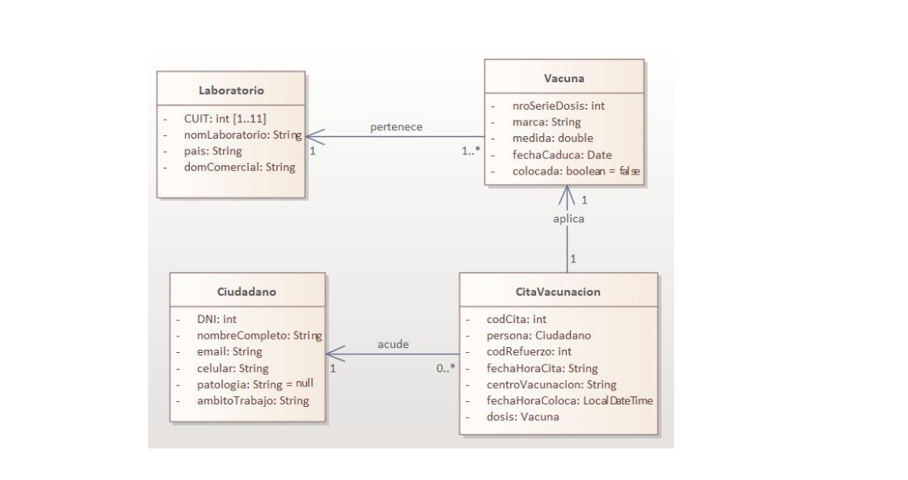
___

### 🛠️ Funcionalidades Principales

### Gestión de Laboratorios

* Registro y Edición: Control detallado de CUIT, nombre comercial y país de origen.
* Buscador Optimizado: Filtro por CUIT mediante coincidencias parciales en tiempo real.
* Eliminación Lógica: Sistema de bajas que mueve registros a una papelera sin borrarlos permanentemente.
* Restauración de Datos: Recuperación de registros inactivos manteniendo la integridad referencial.

### Administracion de Ciudadanos

* Padron de Vacunacion: Registro completo de personas incluyendo DNI, nombres y contacto.
* Busqueda por DNI: Implementacion de un buscador rapido para localizar ciudadanos registrados en el sistema.
* Historial de Inmunizacion: Vinculacion directa entre el ciudadano y las dosis aplicadas de diferentes lotes.
* Validacion de Identidad: Control de duplicados para asegurar que cada DNI corresponda a un unico registro.

### Control de Vacunas y Lotes

* Manejo de Enums: Implementación de TipoAntigeno y MedidaDosis para estandarizar datos.
* Trazabilidad: Seguimiento estricto por número de serie de dosis y fecha de caducidad.
* Cálculo de Stock: Gestión automatizada de viales disponibles por cada lote.

### Arquitectura de Software

* Capa de Persistencia: Spring Data JPA para comunicación eficiente con la base de datos.
* Lógica de Negocio: Servicios transaccionales que aseguran consistencia de datos.
* Interfaz Dinámica: Thymeleaf + Bootstrap 5 para experiencia de usuario fluida.

### Validaciones y Seguridad

* Integridad de Datos: Validación de CUIT numéricos y prevención de duplicados.
* Manejo de Excepciones: Control personalizado de errores para navegación sin fallos.

___

### Vacunar-te: Plataforma Integral de Trazabilidad y Gestión de Inmunización

#### Ecosistema digital desarrollado en Spring Boot 3 para la administración centralizada de ciudadanos, control estricto de lotes de vacunación y seguimiento de la cadena de suministro de laboratorios farmacéuticos.

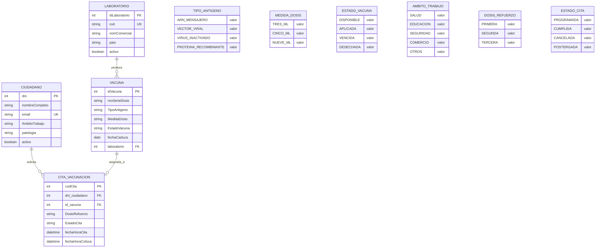

___

### 🔄 Ciclo de Gestión y Navegación Circular (UX)

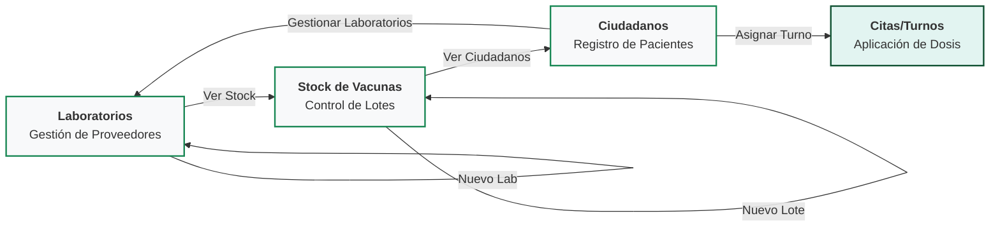
````
"El sistema implementa una arquitectura de navegación bidireccional entre Laboratorios, Stock de Vacunas y Ciudadanos, optimizando los tiempos de carga    
 y operación administrativa en centros de salud."
````
___
### Vistas Vacunas, Ciudadanos y Laboratorio

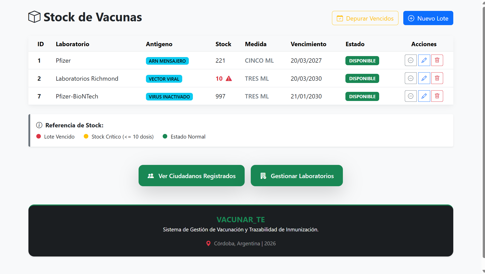

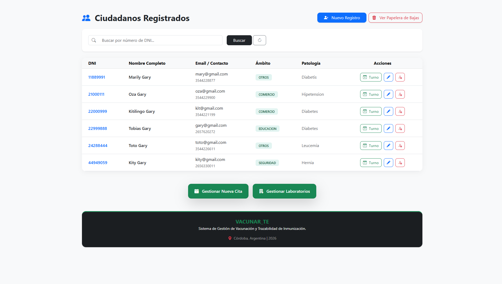

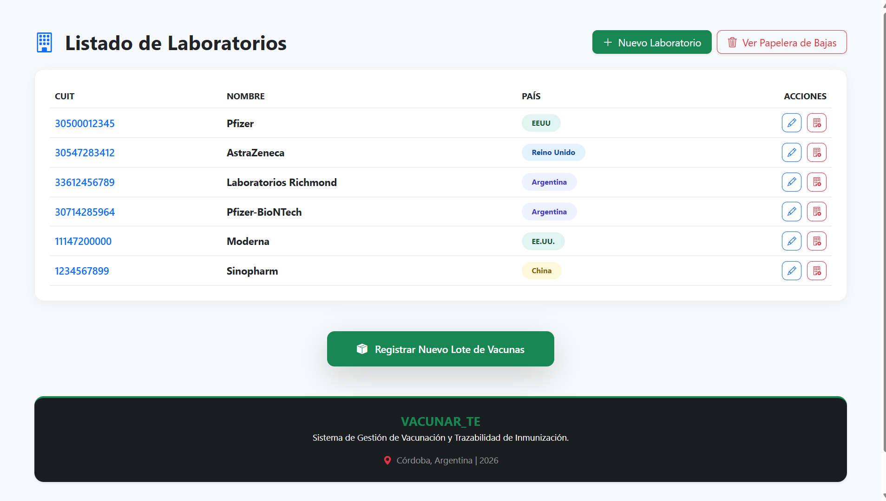
___

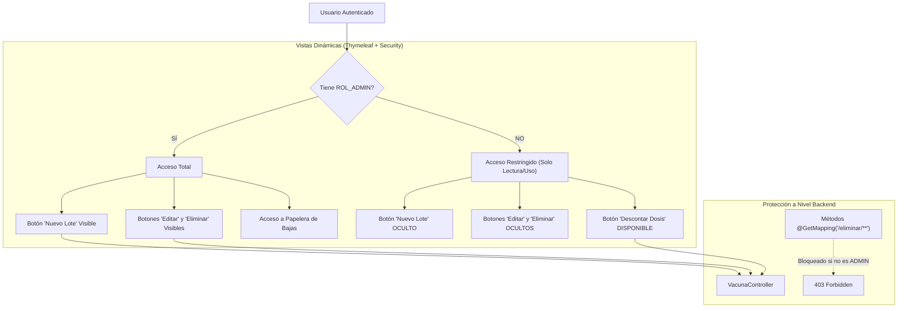
#### Renderización Condicional: Se utiliza el dialecto sec:authorize="hasRole('ADMIN')" de Thymeleaf para ocultar elementos críticos de la interfaz a usuarios sin privilegios, como los botones de edición y borrado.

#### Seguridad por Método: El sistema garantiza que, aunque un usuario intente acceder a una URL de gestión (como /vacunas/eliminar/1) manualmente, Spring Security bloquee la petición si no cuenta con las credenciales necesarias.

#### Interfaz Adaptativa: Los usuarios estándar mantienen la capacidad de interactuar con el stock (botón Descontar) para agilizar la trazabilidad diaria sin comprometer la integridad estructural de los datos del laboratorio.
___

### Modulo de Inteligencia Artificial: Gestion de Turnos
Se ha implementado un asistente virtual basado en Mistral AI (v1.0.0-M5) especializado en la coordinacion de turnos de vacunacion. El agente actua como un filtro inteligente que valida la disponibilidad segun el calendario laboral de Argentina.

````mermaid
graph TD
    A[Consulta de Usuario] --> B{¿Es Dia de Semana?}
B -- No (Sábado/Domingo) --> C[Informar Centro Cerrado]
B -- Si --> D{¿Es Feriado?}
D -- Si --> C
D -- No --> E[Validar DNI y Sugerir Turno]
E --> F[Redireccion a Formulario de Cita]
````

___

### Vistas con Thymeleaf + Security: usando 'admin'; Inicio; Vacunas; Ciudadanos y Laboratorio

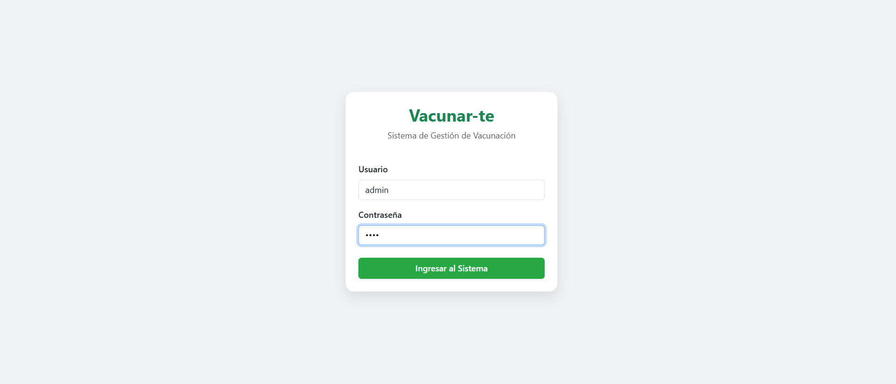

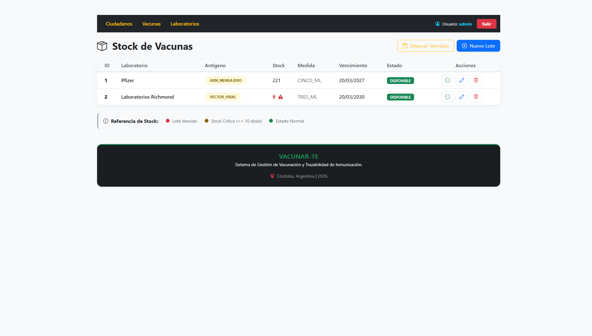

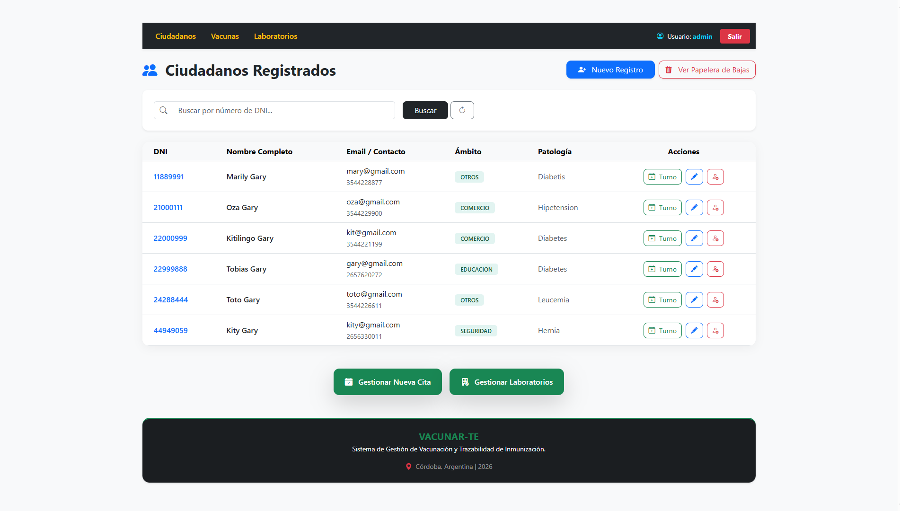

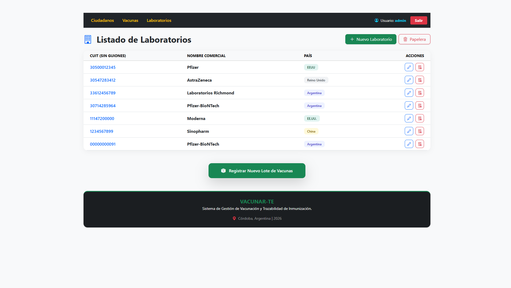

### Vistas con Thymeleaf + Security: usando 'user'; Vacunas y Ciudadanos

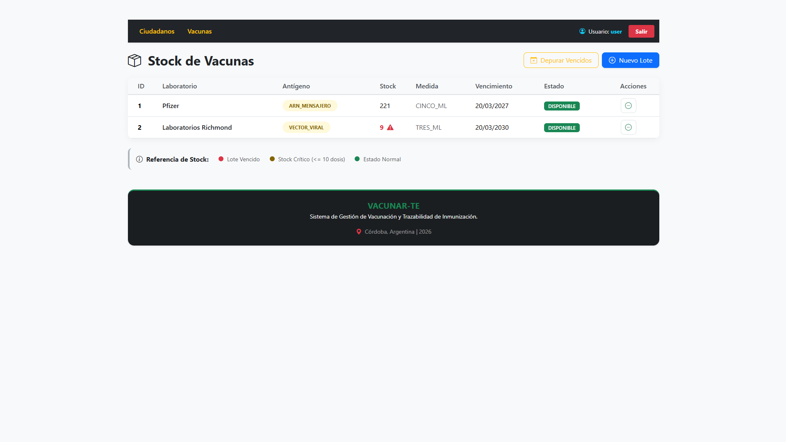

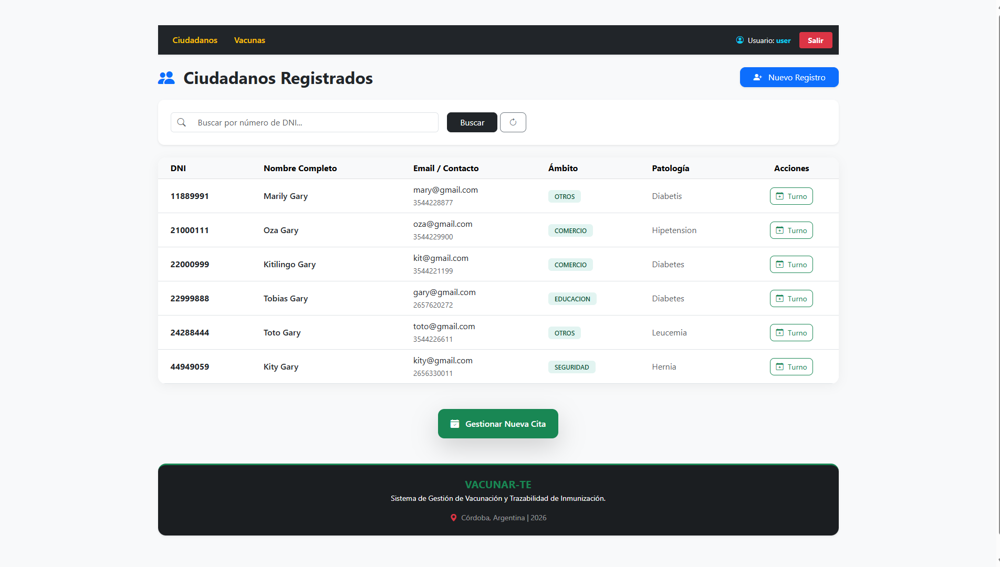
___

### Vista implementación del ChatBot con Mistral: Ciudadanos

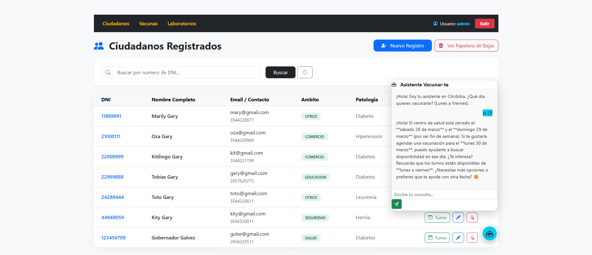
___
## 🛠️ Tecnologías y Recursos Utilizados
| Dependencia / Herramienta | Documentación Oficial                                                                                                                                                |
|---------------------------|----------------------------------------------------------------------------------------------------------------------------------------------------------------------|
| **Java 21 (LTS)**         | [JDK 21 Runtime](https://www.oracle.com/java/technologies/downloads/#java21)                                                                                         |
| **Spring Boot 3.5.x**     | [Framework Base](https://spring.io/projects/spring-boot)                                                                                                             |
| **Spring Data JPA**       | [Persistencia y ORM](https://spring.io/projects/spring-data-jpa)                                                                                                     |
| **Spring Web (MVC)**      | [Gestión de Rutas y Controladores](https://docs.spring.io/spring-framework/reference/web/webmvc.html)                                                                |
| **Spring Validation**     | [Validación de Restricciones](https://docs.jboss.org/hibernate/validator/8.0/reference/en-US/html_single/)                                                           |
| **Thymeleaf**             | [Motor de Plantillas](https://www.thymeleaf.org/)                                                                                                                    |
| **MySQL Connector/J**     | [Driver de Conexión](https://dev.mysql.com/doc/connector-j/en/)                                                                                                      |
| **Lombok**                | [Optimización de Código](https://projectlombok.org/)                                                                                                                 |
| **Thymeleaf Java8Time**   | [Formateo de Fechas](https://github.com/thymeleaf/thymeleaf-extras-java8time)                                                                                        |
| **Spring DevTools**       | [Desarrollo Rápido](https://docs.spring.io/spring-boot/docs/current/reference/html/using.html#using.devtools)                                                        |
| **Maven**                 | [Gestión de Dependencias](https://maven.apache.org/)                                                                                                                 |
| **Spring Security 6**     | [Control de acceso robusto y protección contra vulnerabilidades (CSRF, XSS)](https://spring.io/projects/spring-security)                                             |
| **Thymeleaf Extras**      | [Integración de lógica de seguridad en vistas (Roles ADMIN y USER)](https://www.thymeleaf.org/thymeleaf-extras-springsecurity/)                                      |
| **Mistral AI**            | [Implementación de funcionalidades de IA generativa con Mistral en Spring Boot](https://docs.spring.io/spring-ai/reference/api/embeddings/mistralai-embeddings.html) |
___

## 🚀 Cómo Ejecutar el Proyecto

Sigue estos pasos para tener una instancia local de Vacunar_te funcionando en menos de 3 minutos:

1. Requisitos PreviosJava 17 o superior.
2. MySQL 8.0 o superior.Maven (incluido en el proyecto como mvnw).

## 2. Configuración de Base de Datos

Crea la base de datos en tu terminal de MySQL o Workbench:

````
SQLCREATE DATABASE vacunarte_db;

````

## 3. Variables de Entorno

Para mantener la seguridad, el proyecto utiliza variables de entorno. Puedes configurarlas en tu IDE (IntelliJ) o en tu
sistema:

| Variable    | Descripción         | Ejemplo      |
|-------------|---------------------|--------------|
| DB_NAME     | Nombre de la DB     | vacunarte_db |
| DB_USER     | Usuario de MySQL    | tu_usuario   |
| DB_PASSWORD | Contraseña de MySQL | tu_password  |
| MISTRAL_API_KEY | Tu clave | moTHedQSs... |

___

## Cómo descargar el proyecto

````
git clone https://github.com/cris959/vacunar_te.git
````

## Entra en la carpeta del proyecto:

````
cd vacunar_te
````

Compila y ejecuta el archivo

````
VacunarTeApplication.java
````

___

# Colaboraciones 🎯

Si deseas contribuir a este proyecto, por favor sigue estos pasos:

1 - Haz un fork del repositorio: Crea una copia del repositorio en tu cuenta de GitHub.  
2 - Crea una nueva rama: Utiliza el siguiente comando para crear y cambiar a una nueva rama:

```bash
git chechout -b feature-nueva
```

3 - Realiza tus cambios: Implementa las mejoras o funcionalidades que deseas agregar.  
4 - Haz un commit de tus cambios: Guarda tus cambios con un mensaje descriptivo:

```bash 
git commit -m 'Añadir nueva funcionalidad'
```

5 - Envía tus cambios: Sube tu rama al repositorio remoto:

````bash
git push origin feature-nueva
````

6 - Abre un pull request: Dirígete a la página del repositorio original y crea un pull request para que revisemos tus
cambios.

Gracias por tu interés en contribuir a este proyecto. ¡Esperamos tus aportes!
___

## 👨‍💻 Autor

Desarrollado con ❤️ por **Christian** (Cris959).  
Si tienes alguna duda sobre este proyecto o quieres conectar para hablar de tecnología, ¡no dudes en contactarme!

[](https://www.linkedin.com/in/christian-ariel-garay)
[](https://github.com/cris959)
___

## Licencia 📜

Este proyecto está licenciado bajo la Licencia MIT - ver el
archivo [LICENSE](https://github.com/cris959/vacunar-te/blob/main/LICENSE) para más detalles.

